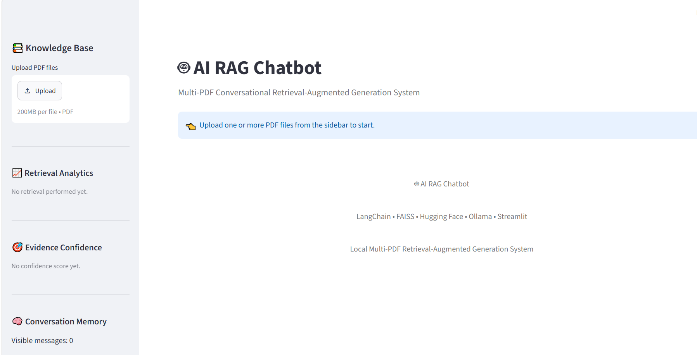
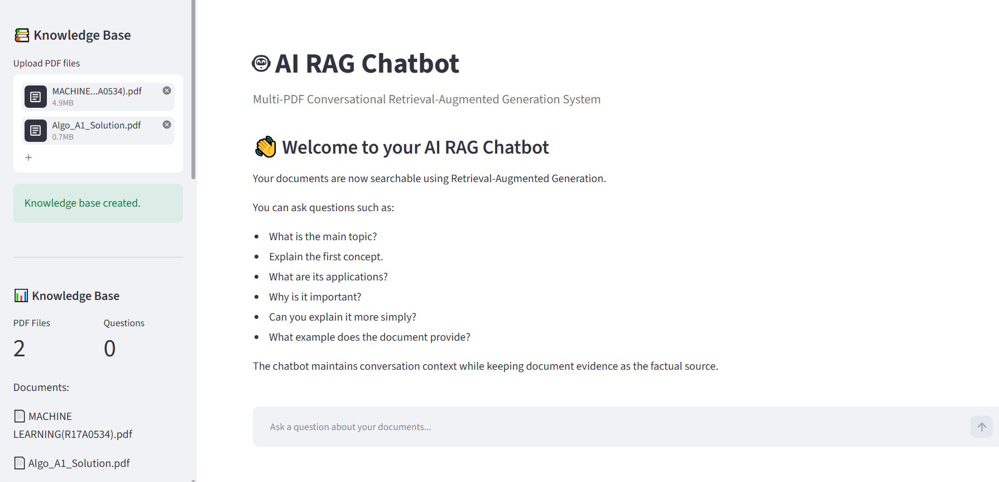
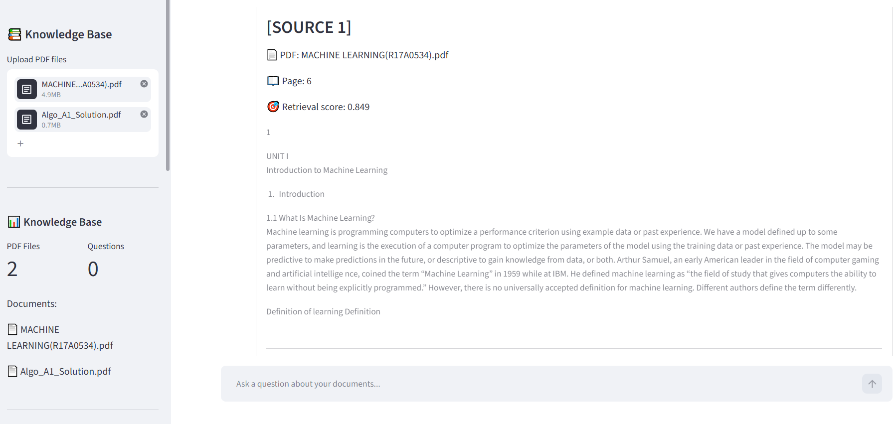
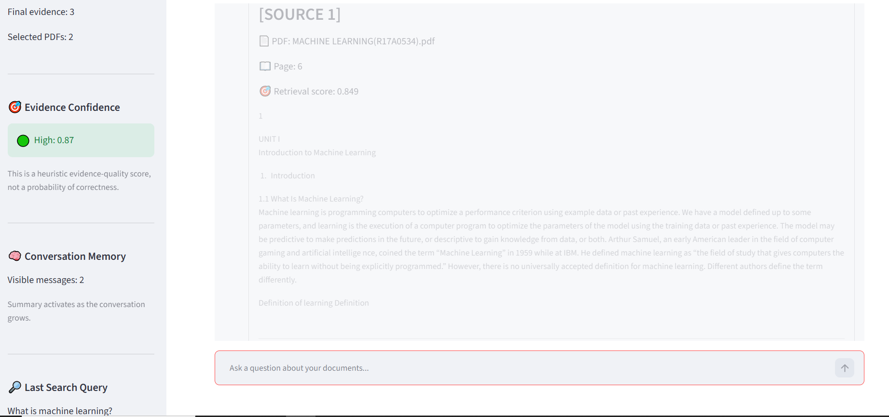
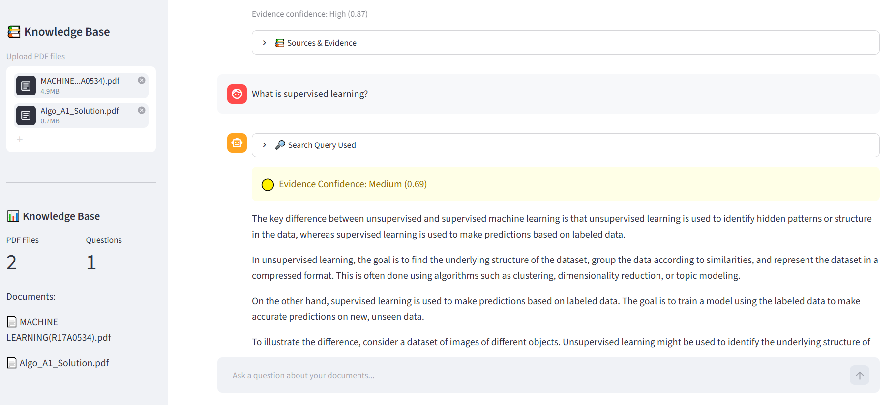

# 🤖 AI RAG Chatbot

### Advanced Multi-PDF Retrieval-Augmented Generation System

A professional document-grounded AI chatbot built with **Python, LangChain, FAISS, Hugging Face Sentence Transformers, Ollama, and Streamlit**.

The system allows users to upload multiple PDF documents, build a persistent local knowledge base, ask questions in natural language, maintain conversational context, filter documents, retrieve relevant passages using hybrid retrieval, rerank results, estimate retrieval confidence, and generate grounded responses with source references.

---

## 🌟 Project Highlights

* 📚 **Multi-PDF knowledge base**
* 🔎 **Semantic vector retrieval**
* 🔤 **Keyword-aware hybrid retrieval**
* 🎯 **Document filtering**
* 📊 **Retrieval reranking**
* 🧠 **Conversational memory**
* 🔄 **Follow-up question rewriting**
* 💾 **Persistent FAISS vector database**
* 🛡️ **Grounded-answer / hallucination-control prompting**
* 📈 **Heuristic retrieval-confidence detection**
* ⚡ **Streaming LLM responses**
* 📑 **Source and page references**
* 🧪 **Project evaluation script**
* 🎨 **Professional Streamlit interface**
* 🔐 **Local-first AI architecture**

---
## 📸 Demo

### Main Interface



### Multi-PDF Knowledge Base



### RAG Answer with Sources



### Conversational Memory



### Retrieval Analytics



# 📌 Table of Contents

* [Project Overview](#-project-overview)
* [Why RAG](#-why-rag)
* [System Architecture](#-system-architecture)
* [Complete RAG Pipeline](#-complete-rag-pipeline)
* [Core Features](#-core-features)
* [Technology Stack](#-technology-stack)
* [AI Models](#-ai-models)
* [Project Structure](#-project-structure)
* [Installation](#-installation)
* [Ollama Setup](#-ollama-setup)
* [Running the Application](#-running-the-application)
* [How the System Works](#-how-the-system-works)
* [Retrieval Strategy](#-retrieval-strategy)
* [Conversation Memory](#-conversation-memory)
* [Confidence Detection](#-confidence-detection)
* [Source References](#-source-references)
* [Evaluation & Testing](#-evaluation--testing)
* [Performance Considerations](#-performance-considerations)
* [Security & Privacy](#-security--privacy)
* [Deployment Considerations](#-deployment-considerations)
* [Future Improvements](#-future-improvements)
* [Learning Outcomes](#-learning-outcomes)
* [Author](#-author)

---

# 📖 Project Overview

Large Language Models can generate fluent answers, but a general-purpose LLM does not automatically know the contents of a user's private documents.

**Retrieval-Augmented Generation (RAG)** solves this problem by connecting a language model with an external knowledge source.

This project implements a complete RAG pipeline where users provide PDF documents as the knowledge source.

Instead of directly asking the LLM to answer from its general knowledge, the application:

1. Loads the PDF documents.
2. Extracts their text.
3. Splits the text into manageable chunks.
4. Converts the chunks into vector embeddings.
5. Stores the embeddings in FAISS.
6. Retrieves relevant document chunks for a question.
7. Filters and reranks the retrieved results.
8. Estimates retrieval confidence.
9. Builds a grounded context.
10. Sends the context to the local Ollama LLM.
11. Streams the generated response.
12. Displays source information for verification.

---

# ❓ Why RAG?

A traditional chatbot can be represented as:

```text
User Question
      ↓
     LLM
      ↓
   Answer
```

The problem is that the LLM may not have access to the user's documents.

This project uses:

```text
User Question
      ↓
   Retrieval
      ↓
Relevant Document Context
      ↓
     LLM
      ↓
Grounded Answer
      ↓
Source References
```

This architecture helps the application answer questions using information retrieved from the user's selected documents.

---

# 🏗️ System Architecture

```text
                         ┌─────────────────────┐
                         │        USER         │
                         │ PDF + Question      │
                         └──────────┬──────────┘
                                    │
                                    ▼
                         ┌─────────────────────┐
                         │    Streamlit UI     │
                         └──────────┬──────────┘
                                    │
                    ┌───────────────┴───────────────┐
                    │                               │
                    ▼                               ▼
          ┌──────────────────┐            ┌──────────────────┐
          │   PDF Pipeline   │            │ Question Pipeline│
          └────────┬─────────┘            └────────┬─────────┘
                   │                               │
                   ▼                               ▼
          ┌──────────────────┐            ┌──────────────────┐
          │  PyPDFLoader     │            │ Question Rewrite │
          └────────┬─────────┘            └────────┬─────────┘
                   │                               │
                   ▼                               ▼
          ┌──────────────────┐            ┌──────────────────┐
          │ Text Chunking    │            │ Hybrid Retrieval │
          └────────┬─────────┘            └────────┬─────────┘
                   │                               │
                   ▼                               ▼
          ┌──────────────────┐            ┌──────────────────┐
          │ MiniLM Embedding │            │ Document Filter  │
          └────────┬─────────┘            └────────┬─────────┘
                   │                               │
                   ▼                               ▼
          ┌──────────────────┐            ┌──────────────────┐
          │ Persistent FAISS │◄───────────┤    Reranking     │
          └──────────────────┘            └────────┬─────────┘
                                                   │
                                                   ▼
                                          ┌──────────────────┐
                                          │    Confidence    │
                                          │     Detection    │
                                          └────────┬─────────┘
                                                   │
                                                   ▼
                                          ┌──────────────────┐
                                          │ Context Builder  │
                                          └────────┬─────────┘
                                                   │
                                                   ▼
                                          ┌──────────────────┐
                                          │ Ollama LLM       │
                                          │ llama3.2:1b      │
                                          └────────┬─────────┘
                                                   │
                                                   ▼
                                          ┌──────────────────┐
                                          │ Grounded Answer  │
                                          └────────┬─────────┘
                                                   │
                                                   ▼
                                          ┌──────────────────┐
                                          │ Source References│
                                          └──────────────────┘
```

---

# 🔄 Complete RAG Pipeline

The application follows this workflow:

```text
PDF Files
   │
   ▼
PDF Loading
   │
   ▼
Text Extraction
   │
   ▼
Recursive Character Chunking
   │
   ▼
Local Sentence Embeddings
   │
   ▼
Persistent FAISS Vector Store
   │
   ▼
User Question
   │
   ▼
Conversation-Aware Question Rewriting
   │
   ▼
Hybrid Retrieval
   │
   ├── Semantic Retrieval
   └── Keyword Matching
   │
   ▼
Document-Level Filtering
   │
   ▼
Relevance Filtering
   │
   ▼
Reranking
   │
   ▼
Retrieval Confidence
   │
   ▼
Context Construction
   │
   ▼
Grounded Prompt
   │
   ▼
Ollama
   │
   ▼
Streaming Answer
   │
   ▼
Source References
```

---

# 🚀 Core Features

## 1. 📚 Multi-PDF Support

Users can upload multiple PDF documents and create a combined knowledge base.

Each chunk maintains metadata such as:

* Source PDF
* Page number
* Document information

This allows the application to identify where retrieved information originated.

---

## 2. 🧩 Intelligent Document Chunking

Large documents are divided into smaller chunks before embedding.

The application uses:

```text
RecursiveCharacterTextSplitter
```

with the project configuration:

```text
Chunk Size: 1000 characters
Chunk Overlap: 200 characters
```

Chunk overlap helps preserve contextual information between neighboring chunks.

---

## 3. 🧠 Local Embeddings

The project uses:

```text
sentence-transformers/all-MiniLM-L6-v2
```

The embedding model converts text into numerical vector representations.

Conceptually:

```text
Text
 ↓
Embedding Model
 ↓
Vector
```

Questions are embedded in the same vector space so that semantically related content can be retrieved.

---

## 4. 💾 Persistent FAISS Vector Store

The project uses **FAISS** for vector similarity search.

The application creates persistent indexes based on the uploaded document collection.

Conceptually:

```text
PDF Collection
      ↓
Content Hash
      ↓
FAISS Index
      ↓
Persistent Storage
```

This allows previously processed document collections to be reused instead of unnecessarily rebuilding the vector database.

---

## 5. 🔎 Hybrid Retrieval

The retrieval system combines multiple signals.

### Semantic Retrieval

Finds chunks that are conceptually similar to the question.

### Keyword Retrieval

Checks important terms from the question against document content.

### Question Overlap

Considers overlap between question terms and retrieved content.

These signals are combined to improve candidate selection.

---

## 6. 🎯 Reranking

Retrieved candidates are reranked before being passed to the LLM.

The current scoring strategy combines:

```text
50% Semantic Relevance
30% Keyword Relevance
20% Question-Word Overlap
```

The highest-ranked candidates are selected for context construction.

---

## 7. 📄 Document Filtering

When multiple PDFs are uploaded, users can choose which documents participate in retrieval.

Example:

```text
Selected Documents

☑ Machine Learning.pdf
☑ Deep Learning.pdf
☐ History.pdf
```

Only the selected documents are considered by the retrieval pipeline.

---

## 8. 🔄 Conversational Question Rewriting

Follow-up questions may depend on earlier messages.

Example:

```text
User:
What is deep learning?

User:
What are its applications?
```

The second question does not explicitly mention deep learning.

The application uses conversation history to transform the follow-up into a standalone retrieval question.

This improves retrieval for conversational interactions.

---

## 9. 🧠 Conversation Memory

The chatbot maintains conversation history.

To prevent excessive context from being sent to the LLM, the system manages:

* Recent conversation turns
* Older conversation summaries
* Maximum memory size
* Maximum summary size

The UI can also display the conversation-memory state.

---

## 10. 📊 Retrieval Confidence

The application estimates the quality of retrieved results.

It uses thresholds such as:

```text
High Confidence
≥ 0.70

Medium Confidence
≥ 0.45

Low Confidence
< 0.45
```

These values are used as **heuristic retrieval-quality indicators**.

They are **not calibrated probabilities** and should not be interpreted as guaranteed answer accuracy.

---

## 11. 🛡️ Grounded Responses

The prompt instructs the LLM to prioritize retrieved document context.

The intended behavior is:

```text
Relevant information exists
        ↓
Use retrieved document context
        ↓
Generate grounded answer
```

If sufficient information is unavailable, the application is designed to avoid confidently inventing unsupported document-specific information.

---

## 12. ⚡ Streaming Responses

Instead of waiting for the complete LLM response, the application streams generated text to the Streamlit interface.

Conceptually:

```text
LLM
 ↓
Token/Chunk
 ↓
UI
 ↓
Token/Chunk
 ↓
UI
 ↓
...
```

This makes the interaction feel more responsive.

---

## 13. 📑 Source References

The application provides source information for retrieved content.

Sources can include:

```text
PDF Filename
Page Number
Retrieved Content
Relevance Information
```

This allows users to inspect the underlying document evidence.

---

## 14. 🧪 Error Handling

The application handles common runtime problems such as:

* Invalid PDFs
* Empty documents
* Corrupted PDFs
* Missing documents
* Retrieval failures
* FAISS errors
* Ollama connection problems
* Missing Ollama models
* Invalid document selections

---

# 🧰 Technology Stack

| Technology             | Role                         |
| ---------------------- | ---------------------------- |
| Python                 | Application development      |
| Streamlit              | Web interface                |
| LangChain              | RAG orchestration            |
| LangChain Community    | Document/vector integrations |
| LangChain Hugging Face | Local embedding integration  |
| LangChain Ollama       | Local LLM integration        |
| FAISS                  | Vector similarity search     |
| Sentence Transformers  | Text embeddings              |
| PyPDF                  | PDF processing               |
| Ollama                 | Local LLM runtime            |
| Git                    | Version control              |
| GitHub                 | Source-code hosting          |

---

# 🤖 AI Models

## Language Model

```text
llama3.2:1b
```

Runtime:

```text
Ollama
```

The model runs locally and is used for response generation.

The smaller 1B model was selected to make local execution more practical on limited-memory hardware.

---

## Embedding Model

```text
sentence-transformers/all-MiniLM-L6-v2
```

Used for:

* Document embeddings
* Query embeddings
* Semantic similarity search

---

# ⚙️ Project Configuration

| Configuration       | Value              |
| ------------------- | ------------------ |
| LLM                 | `llama3.2:1b`      |
| Embedding Model     | `all-MiniLM-L6-v2` |
| Chunk Size          | `1000`             |
| Chunk Overlap       | `200`              |
| Retrieval K         | `3`                |
| Candidate Fetch K   | `8`                |
| Retrieval Threshold | `1.20`             |
| Maximum Context     | `6000` characters  |
| Recent Messages     | `6`                |
| Maximum Memory      | `5000` characters  |
| Maximum Summary     | `2000` characters  |
| Context Window      | `2048`             |

These are application-level settings and may be adjusted depending on hardware and document characteristics.

---

# 📁 Project Structure

```text
RAG_Chatbot/
│
├── data/
│   └── # Local PDF files
│
├── faiss_indexes/
│   └── # Persistent FAISS indexes
│
├── legacy/
│   └── # Earlier development modules
│
├── venv/
│   └── # Local Python environment
│
├── app.py
├── evaluate_rag.py
├── README.md
├── requirements.txt
└── .gitignore
```

### Main Files

#### `app.py`

The primary application containing the integrated RAG chatbot.

#### `evaluate_rag.py`

Basic project-structure evaluation and testing utility.

#### `requirements.txt`

Python dependencies required to install the project.

#### `.gitignore`

Prevents local/private/generated files from being committed.

---

# 💻 Installation

## 1. Clone the repository

```bash
git clone YOUR_GITHUB_REPOSITORY_URL
```

Then:

```bash
cd RAG_Chatbot
```

---

## 2. Create a virtual environment

On Windows:

```powershell
python -m venv venv
```

Activate it:

```powershell
venv\Scripts\Activate
```

---

## 3. Install dependencies

```powershell
pip install -r requirements.txt
```

---

# 🦙 Ollama Setup

Install Ollama on the local machine.

Then download the required model:

```powershell
ollama pull llama3.2:1b
```

Test the model:

```powershell
ollama run llama3.2:1b
```

After confirming the model works, exit the Ollama interactive session and start the Streamlit application.

---

# ▶️ Running the Application

From the project directory:

```powershell
streamlit run app.py
```

The Streamlit application will provide a local web address.

Open the displayed address in your browser.

---

# 📖 How to Use

## Step 1 — Upload Documents

Use the sidebar to upload one or multiple PDF documents.

---

## Step 2 — Process the Knowledge Base

The application extracts the PDF text, creates chunks, generates embeddings, and creates or loads the appropriate FAISS knowledge base.

---

## Step 3 — Select Documents

If multiple PDFs are available, select the documents that should be used for retrieval.

---

## Step 4 — Ask a Question

Enter a natural-language question.

Example:

```text
What are the main concepts discussed in this document?
```

---

## Step 5 — Review the Answer

The application retrieves relevant information and generates a response using the local Ollama model.

---

## Step 6 — Verify Sources

Inspect the displayed source information to understand which document pages contributed to the response.

---

# 🔬 Retrieval Strategy

The retrieval process can be represented as:

```text
Question
   ↓
Question Rewriting
   ↓
Semantic Candidate Retrieval
   ↓
Keyword Matching
   ↓
Document Filtering
   ↓
Relevance Filtering
   ↓
Candidate Combination
   ↓
Reranking
   ↓
Top Results
```

The system intentionally separates **retrieval** from **generation**.

This is a fundamental RAG design principle.

---

# 🧠 Conversation Memory Strategy

The application distinguishes between:

### Complete visible history

The user can see the conversation in the interface.

### LLM memory

Only an appropriately sized representation of the conversation is sent to the model.

The system uses:

```text
Older Messages
      ↓
Summary
      +
Recent Messages
      ↓
Compact Memory
      ↓
LLM
```

This helps prevent unnecessary growth of the prompt.

---

# 📊 Confidence Strategy

The project calculates a heuristic retrieval-confidence value from retrieval signals.

Conceptually:

```text
Semantic Relevance
        +
Keyword Relevance
        +
Question Overlap
        ↓
Confidence Heuristic
```

The confidence value helps the application determine whether retrieved evidence appears sufficiently relevant.

### Important limitation

This is **not an evaluated model probability**.

For production systems, confidence should ideally be calibrated and validated using a labeled evaluation dataset.

---

# 🧪 Evaluation & Testing

The project includes:

```text
evaluate_rag.py
```

Run:

```powershell
python evaluate_rag.py
```

The project should also be manually evaluated using several categories.

### Retrieval Test

Ask questions whose answers are clearly present in the documents.

### Follow-Up Test

Example:

```text
What is machine learning?

What are its main applications?
```

### Hallucination Test

Ask about information that is deliberately absent from the uploaded documents.

The system should avoid presenting unsupported document-specific claims as though they came from the PDF.

### Multi-PDF Test

Upload two documents and select only one.

Ask a question whose answer exists only in the unselected document.

The selected-document filtering should prevent that document from participating in retrieval.

### Persistence Test

Process documents, restart Streamlit, and verify that the existing FAISS knowledge base can be reused.

### Memory Test

Ask several related follow-up questions and verify that conversational context is maintained.

### Error Handling Test

Test:

* No PDF
* Invalid PDF
* Empty PDF
* Multiple PDFs
* No selected documents
* Ollama unavailable

---

# 📈 Performance Considerations

This project is designed around a local-first architecture.

The `llama3.2:1b` model reduces hardware requirements compared with larger local models.

The application also limits:

```text
Context Size
Conversation Memory
Retrieved Results
Candidate Results
```

These controls help reduce unnecessary memory consumption.

Performance will vary according to:

* CPU
* RAM
* Storage speed
* Number of PDFs
* Document size
* Number of chunks
* Ollama model
* Embedding model

---

# 🔐 Security & Privacy

The project is designed to process the document knowledge base locally.

The response-generation model runs through Ollama on the user's machine.

The repository intentionally ignores:

```text
.env
venv/
faiss_indexes/
PDF files
```

These files may contain private data, generated data, or environment-specific information.

Users should still follow appropriate organizational and legal requirements when processing confidential documents.

---

# ☁️ Deployment Considerations

The current architecture depends on:

```text
Ollama
+
Local LLM
+
Local FAISS
```

This makes the application well suited to local execution.

A cloud deployment requires additional architecture because a hosted Streamlit environment cannot simply access Ollama running on the developer's personal computer.

Possible production architectures include:

```text
Streamlit
    ↓
Cloud-hosted API
    ↓
Cloud LLM
```

or:

```text
Streamlit
    ↓
Backend API
    ↓
Dedicated LLM Server
    ↓
Vector Database
```

For a production deployment, additional considerations include:

* Authentication
* Persistent storage
* Vector database hosting
* LLM hosting
* API security
* Rate limiting
* Document access control
* Monitoring
* Evaluation
* Cost management

---

# 🔮 Future Improvements

Potential future improvements include:

* Advanced neural reranking
* Retrieval evaluation datasets
* Recall@K
* Precision@K
* Mean Reciprocal Rank
* Faithfulness evaluation
* Automated RAG evaluation
* Better citation formatting
* Additional embedding models
* Multilingual retrieval
* DOCX support
* TXT support
* Web-page ingestion
* Authentication
* User-specific knowledge bases
* Cloud vector databases
* Cloud LLM support
* Production API backend
* Observability and logging
* Automated test suites

---

# 🎯 Learning Outcomes

This project demonstrates practical experience with:

### Generative AI

* Large Language Models
* Prompt Engineering
* Grounded Generation
* Local LLMs

### Retrieval-Augmented Generation

* Document ingestion
* Chunking
* Embeddings
* Vector search
* Hybrid retrieval
* Reranking
* Context construction
* Source attribution

### LangChain

* Document loaders
* Text splitters
* Embeddings
* Vector stores
* LLM integration
* RAG pipeline design

### Machine Learning / NLP

* Sentence embeddings
* Semantic similarity
* Keyword matching
* Information retrieval

### Software Engineering

* Python application architecture
* Streamlit
* Error handling
* Configuration management
* Persistent storage
* Git
* GitHub
* Testing

---

# 🧩 Key Engineering Concepts Demonstrated

The project demonstrates the difference between:

```text
LLM
```

and:

```text
RAG System
```

A language model generates text.

A RAG system combines:

```text
Knowledge Retrieval
        +
Context Construction
        +
Language Generation
```

This project therefore demonstrates more than simply calling an LLM API. It implements the surrounding retrieval and document-processing infrastructure required for a practical document-grounded AI application.

---

# 🏆 Project Status

```text
✅ Project Setup
✅ PDF Processing
✅ Text Chunking
✅ Local Embeddings
✅ FAISS Vector Store
✅ Persistent Knowledge Base
✅ Multi-PDF Support
✅ Document Filtering
✅ Semantic Retrieval
✅ Hybrid Retrieval
✅ Reranking
✅ Confidence Heuristic
✅ Conversational RAG
✅ Question Rewriting
✅ Conversation Memory
✅ Streaming Responses
✅ Source References
✅ Error Handling
✅ Professional Streamlit UI
✅ Evaluation
✅ Git Repository
✅ GitHub Preparation
```

---

# 👨‍💻 Author

## Rayan Ahmad

AI / Machine Learning Developer

Interested in:

* Artificial Intelligence
* Machine Learning
* Natural Language Processing
* Generative AI
* Retrieval-Augmented Generation
* Agentic AI
* AI Engineering

---

# ⭐ Project Goal

The goal of this project is to demonstrate the design and implementation of a practical **Retrieval-Augmented Generation system** using open-source and locally executable AI technologies.

The project focuses on:

```text
Reliable Retrieval
       +
Relevant Context
       +
Grounded Generation
       +
Conversational Interaction
       +
Source Transparency
```

The result is a complete document-question-answering system that connects PDF knowledge with a local language model through a structured RAG pipeline.
